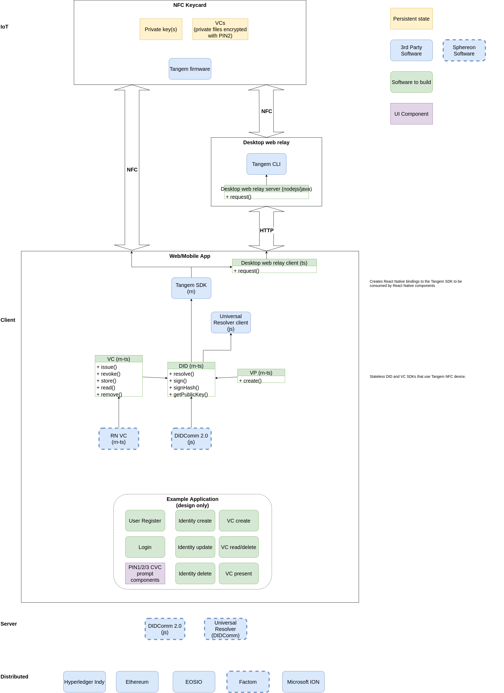

# Functional overview
The SSI-NFC bridge consists of an SDK that allow developers to use SSI components that are cryptographically signed or bound to the NFC device, as explained below.

## React Native SSI-NFC software development kit (SDK)
This is a react native SDK which allows developers to build SSI  applications using the features of the NFC devices. There are three planned libraries to support DIDs, verifiable credentials and verifiable presentations.  These libraries will make  the use of the React Native Tangem SDK and create the abstraction layers on top of this to facilitate easy-to-build SSI applications that take advantage of the secure Tangem NFC devices.

Support for additional SSI components can be added. DIDComm may be supported in the future if sufficient interest is shown.

### Architecture

As seen in the architecture diagram, the NFC-SSI bridge SDK will use the React Native Tangem SDK to communicate with the Tangem device using the NFC transport protocol. The Tangem device stores a private key, which can be used to digitally sign transactions. The device can then be used to create DIDs, sign verifiable credentials, verifiable presentations and more.

The DID module will be fully DID method independant. Any blockdhain or verification registry can be used with this SDK.

See
- [did.md](./did.md)
- [vc.md](./vc.md)
- [vp.md](./vp.md)

To communicate with NFC devices through an NFC reader on desktop, the SDK will connect via a local http connection to a locally installed application which will relay the request to the NFC device and back. This thin relay app will host an http server and convert requests to NFC requests using the Tangem Java SDK.

## Support
The SSI-NFC bridge will support React Native projects, with the same prerequisites as React Native to use.

Additionally:
- Mobile devices will need to have an NFC reader to be able to use these libraries.
- Desktop clients will need to have an inbuilt or USB NFC reader and the Web desktop relay software installed.